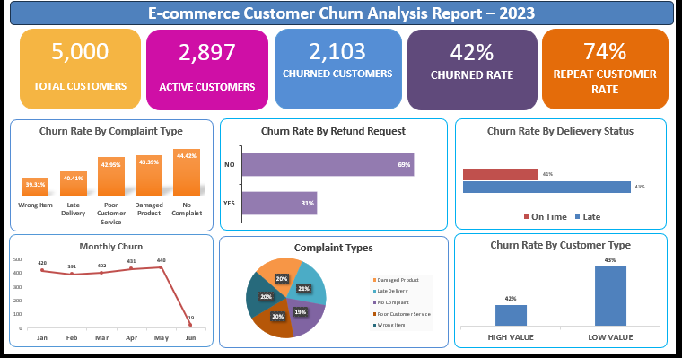

# 📊 E-commerce Customer Churn Analysis Report – 2023

## 📝 Project Overview  
This Excel dashboard analyzes customer churn for an e-commerce platform, offering data-driven insights to improve retention strategies. It summarizes customer activity, complaint patterns, and refund behaviors to help identify areas of concern and opportunity.

## 📷 Screenshot  
  
*Above: Snapshot of the dashboard built in Excel showing churn metrics, complaint breakdown, and customer behavior analysis.*

## 📈 Key Metrics  
- **Total Customers**: `5,000`  
- **Active Customers**: `2,897`  
- **Churned Customers**: `2,103`  
- **Churn Rate**: `42%`  
- **Repeat Customer Rate**: `74%`  

## 📊 Visuals in Dashboard  
- **Churn Rate by Complaint Type**  
  - Highest churn linked to *Late Delivery* and *Poor Customer Service* (both 40.63%)  
- **Churn Rate by Refund Request**  
  - 31% of churned customers had requested a refund  
- **Churn Rate by Delivery Status**  
  - 45% of churned users faced late delivery  
- **Monthly Churn Trends**  
  - Steady churn from Jan–May; sharp dip in June  
- **Complaint Types (Pie Chart)**  
  - Top 3: Damaged Product, Late Delivery, No Complaint  
- **Churn Rate by Customer Type**  
  - Higher churn among **Low Value** customers (58%) vs. **High Value** (42%)  

## 🛠 Tools Used  
- Microsoft Excel  
  - Pivot Tables  
  - Charts (Bar, Line, Pie)  
  - Conditional Formatting  
  - Dashboard Design  

## 💡 Key Insights  
- Delivery delays and refund requests are major churn triggers  
- Low-value customers contribute more to churn  
- A significant portion of churned users reported *no complaints*, indicating silent churn  
- Improving delivery timelines and post-purchase services could enhance retention  

## 📂 Files Included  
- Excel Dashboard (not included here – available on request)  
- Screenshot of Dashboard (used for portfolios or project showcase)

## 🚀 Project Type  
**Customer Churn Analysis | Excel Dashboard | Data Visualization**
"""
